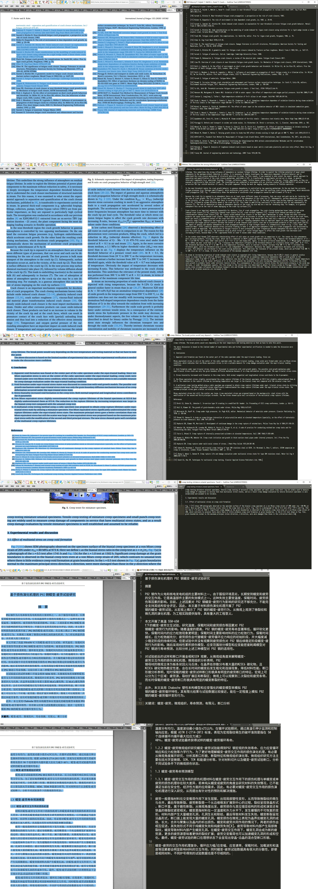

- 以尽可能简单的方式恢复PDF中原有的语义分段。依靠段落中的标点符号和关键字识别。
- 只写了C#实现的版本（方便在Quicker中调用）

- 对应的Quicker子程序：[子程序](https://getquicker.net/subprogram?id=4f23a649-6f62-4b94-bb9f-08da2b930548)和简单的[文本分段动作演示](https://getquicker.net/Sharedaction?code=22e30d6e-af39-4c4f-cff6-08da28a3f6eb)
- 对应的Quicker动作：[Quicker与沙拉查词联动](https://getquicker.net/Sharedaction?code=b0d1a134-8284-4a44-d1be-08d746da5869)

# 效果展示
